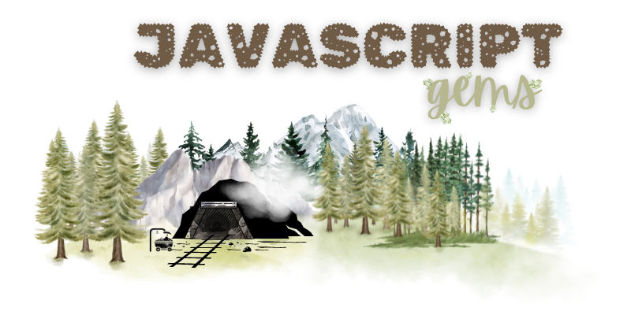
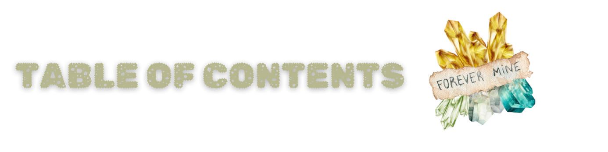
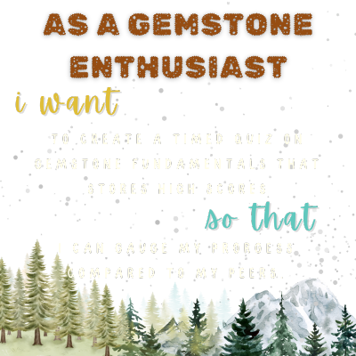
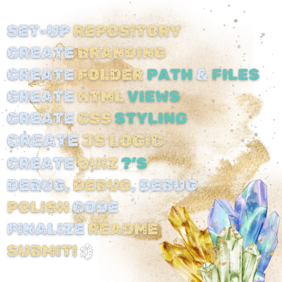

 

### 

  - [OVERVIEW](#overview)
    - [*user story*](#user-story)
    - [*acceptance criteria*](#acceptance-criteria)
    - [*gemstone list*](#gem-list)
  - [INSTALLATION](#installation)
  - [USAGE](#usage)
    - [*screenshot*](#screenshot)
    - [*demo*](#demo)
  - [LICENSE](#license)
  - [LINKS](#links)
  - [CONNECT](#connect)

  ### 

`JAVASCRIPT GEMS` is a timed quiz with multiple-choice questions. This app runs in the browser and features [HTML](https://developer.mozilla.org/en-US/docs/Web/HTML), [CSS](https://www.w3.org/Style/CSS/Overview.en.html#:~:text=What%20is%20CSS%3F,from%20the%20CSS%20working%20group.), and is powered by [JavaScript](https://www.javascript.com/).

### 
<!-- 

  

 -->

### 
<!-- 

  

 -->

### 
<!-- 

  

 -->

#
<!-- 
### 

#

### 

### 
        
### 

#

### 

##### [mit license](./LICENSE)

### 

##### [*github repo*](https://github.com/christiecamp/js-gems) -->

### 

🚧  under construction - come back soon!🚜